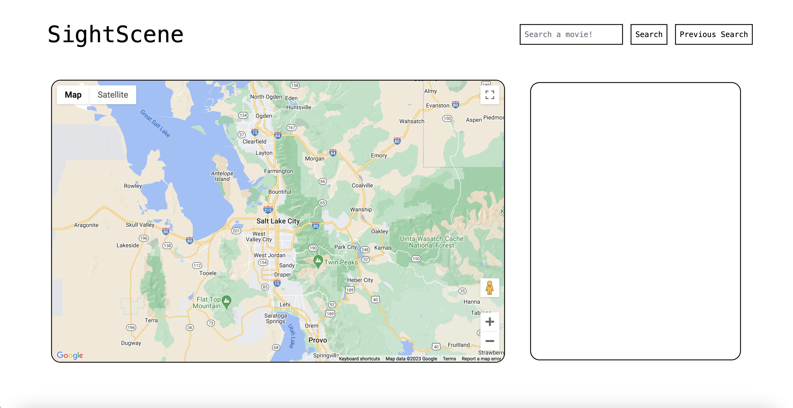

# SightScene

## Description
AS a movie fanatic and a lover of travel, I want to visit the filming locations of my favorite movies, WHEN I go to "SightScene", THEN I can search by movie title, SO THAT I can get location pins and directions to visit the locations

## Table of Contents (Optional)

## Installation
No intallation needed. Web Application is accessed through a URL. 

## Usage
Upon navigating to https://nicholasmelo.github.io/SightScene/ user will be presented with a search bar. User can search movie library by title. Then user is presented with a map and list of filming locations from the searched movie. When user selects a location they have the option to navigate to that location and will be presented with driving/walking directions. User can also use navigation bar to search another movie title or go back to the homepage.

## Credits

Project Collaborators inlcude;
Project Manager: Nicholas Melo
Team Member: Dana Fulmer
Team Member: Zachary Chamberlain
Team Member: Brittney Young

APIs used in application include;
* Google Maps
* MoviesMiniDatabase

## License
The last section of a high-quality README file is the license. This lets other developers know what they can and cannot do with your project. If you need help choosing a license, refer to [https://choosealicense.com/](https://choosealicense.com/).
